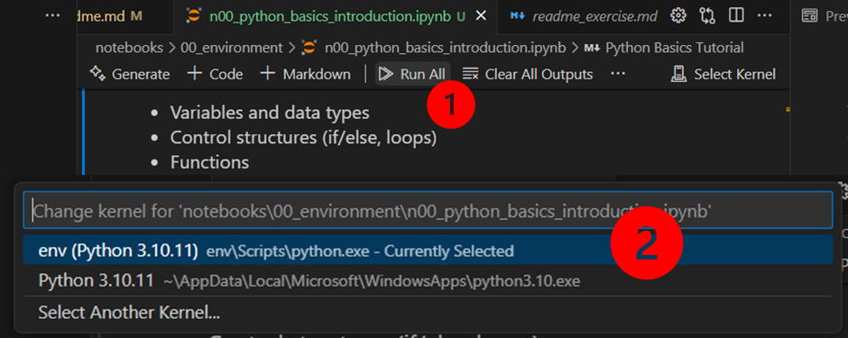
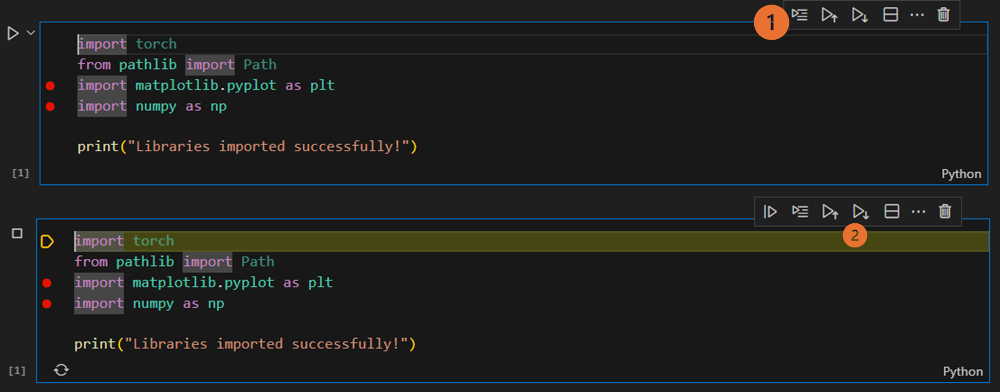

# Artificial Intelligence Applied to Industrial Control 

This repository is part of a course designed to provide students with the fundamental concepts and techniques of Artificial Intelligence (AI) currently used to solve real-world problems in Industrial Control which is lectured at the University of the Basque Country. 

Developed by [Artzai Picon](https://github.com/samtzai)

## What's Included

This course repository contains comprehensive materials organized into two different sections:

- **Notebooks**: They are meant to help the student to understand the concepts tought during the classes. They are based on python notebooks.
- **src**: As python notebooks are not suitable for professional coding. in this section, we include modular python code to help the students learn appropiate python coding.

### 📚 **Notebooks** (`notebooks/`)
- **Environment Setup** (`00_python_basics/`): Python basics and introduction
- **Introduction to AI** (`01_introduction/`): 
  - Linear model training 
  - Complex function fitting exercises
- **Predictive Maintenance** (`02_predictive_maintenance/`):
  - Supervised classification techniques
  - Unsupervised anomaly detection
  - Overfitting prevention strategies
  - Feature selection methods
  - Complete supervised classification application
- **Steel Defects Classification** (`03_steel_defects_classification/`):
  - Binary and multiclass classification demos using CIFAR-10
  - Data augmentation techniques with quizzes
- **Reinforcement Learning** (`07_reinforcement_learning/`):
  - Q-learning tutorial with grid robot
  - Lunar lander reinforcement learning implementation
  - Pre-trained models and comprehensive quizzes

### 🛠️ **Source Code** (`src/`)
- Modular exercises (`exercise_01/` through `exercise_09/`)
- Reusable utility functions and classes

### 💾 **Data** (`data/`)
- ECG datasets for biomedical signal processing

### 📋 **Configuration Files**
- `pyproject.toml`: Python project configuration
- `Makefile`: Build and automation scripts
- `general_installation.md`: Platform-specific installation guides

## Installation:
Follow this section if you are installing the development tools in your own computer. 
This process has been already done at the University lab. 
In that case, go to the "Open the repository in VS Code" section.

If you are installing it on linux. Use the[./Makefile](./Makefile) instead to create the environment.

### INSTALL APPLICATIONS
1) Install python3 from the Microsoft Store (python 3.13)
2) Install VSCode from the Microsoft Store
<!-- 3) Install the following software:
    - Git: 
    ```bash
    https://git-scm.com/downloads/win
    ``` -->
### CONFIGURE WINDOWS POLICIES

In windows, if large directories are not allowed, change script policy in Powershell with admin rights:

1) Open PowerShell with Administrative privileges (**Abrir como administrador**)
2) Execute the following command:
```bash
New-ItemProperty -Path "HKLM:\SYSTEM\CurrentControlSet\Control\FileSystem" ` -Name "LongPathsEnabled" -Value 1 -PropertyType DWORD -Force
```
3) Execute the following commnand to allow script execution (**Abrir como administrador**)

Note: In windows, if script running rights are not allowed, change script policy in Powershell with admin rights. 

```bash
Set-ExecutionPolicy -Scope CurrentUser -ExecutionPolicy RemoteSigned
```
## Configure your development stack:
1) Open VSCode
2) Install the following extensions on the extensions tab in VS Code    
    - Recommended extensions in VS Code:
        - Jupyter
        <!-- - WSL -->
        <!-- - Remote Explorer -->
        - Python
        - Excel Viewer
        - Git Graph
        - Rainbow CSV
        <!-- - Ruff -->
        <!-- - vscode-pydata-viewer -->
        - Markdown Preview Mermaid Support
        <!-- - Remote SSH -->
        <!-- - Material Icon Theme -->
<!-- 3) Configure git
    - In VSCode, open new terminal (menu, terminal, new)
    - Run the following commands: 
        Configure name and email in git
        ```bash
        git config --global user.name "Your Name"
        git config --global user.email "Your Email"
        ```
        set merge instead of rebase
        ```bash
        git config --global merge.rebase false
        ```
    - Close the terminal -->

## Open the repository in VS Code
1) Open VS Code
2) OPTION1: Clone the repository from github (if not downloaded from eGela)
    - Open the command palette (Ctrl+Shift+P)
    - Write "Git: Clone"
    - select "clone from github". This will help you clone the repository without the need of ssh keys
    - Write the url of the repository: https://github.com/your_group/your_project
    - Select the folder where you want to clone the repository
2) OPTION2: If downloaded  DownloadZip in github:
    - Go to code in github and select download zip
    - Unzip the folder
    - Move the unzipped folder to a short folder (e.g. C:\practicas_ia)
    -
3) Open the repository
    - Open the command palette (Ctrl+Shift+P)
    - Write "Open in Folder"
    - Select the folder where you cloned the repository

## Create environment
1) Open your project in VS Code
2) Open a new Terminal
    - Execute script create_env.ps1
        ```bash
        .\scripts\create_env.ps1
        ```
    - Assure that the environment is activated. Execute:
        ```bash
        .\env\Scripts\activate
        ```
  When VSCODE detect that you are creating a new environment, say yes
## Run/Debug a Jupyter-Notebook in VSCODE
0) Open the notebook you want to run and make sure it is on the active tab.
1) Press Run-All option to run all the notebook 

2) Select the generated environmentr (env)
 
If we want to debug step by step instead, we will go to the cell:
1) press "Run-By-Line":
2) press "run next line"

Remember that you can set breakpoints (red-dots). Code execution will stop there.

## Run/Debug a module in VSCODE
1) Open the repository in VS Code
2) Open the "run and debug" section
3) Select the configuration you want to run (e.g. "Python: Current Module" or "src.exercise_01.dataset")
4) Press Start debugging

<!-- ## Submitting the code
When you finish the exercise, you need to submit the code to the course coordinator.
1) Submit the code to the course coordinator by pushing the changes to your repository
```bash
git add .
git commit -m "commit message"
git push
``` -->
 


