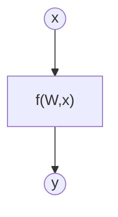
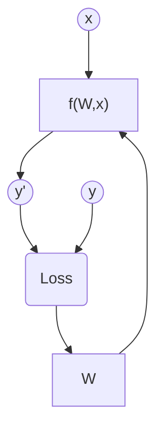

# Exercise 1: Learn a linear function with PyTorch

## Objective

The objective of this exercise is to model an unknown function by a machine learning method.

*Teacher's Note: The function that we are trying to model is the linear function y = 5x + 2. The purpose of the exercise is not to discover the analytical function, but to create a model that best mimics the behavior of that function, even if it is a black box for the user.*

## Task Formalization

The task in hand can be formalized in two steps. First, we will define what we are tring to achieve as clearlly as possible. Second, we will define the approach we are taking to solve it.

### What we are trying to do (Inference)
There is an unknown function $f$ for which we have a bunch of data about certain input $x$ and its corresponding output $y$.

$$
y = f(x)
$$

We are trying to create a model of $f$ using a Machine Learning method to infer the $W$ weight matrix that better expreses the relationship between $x$-$y$ pair of data. Mathematically expressed:

$$
y = f(W,x)
$$

Graphically expressed:

The input vector has size [bs x 1]. The weight matrix has size [1 x 1]

### How we are going to do it (Training)

*Task for the student: Explain what the following diagram is trying to represent. Correct anything if it can be better expressed. You can add your own picture (hand-drawn or otherwise) if you do not like using mermaid. As long as you are able to show us that you understand what you are doing graphically we are OK.*

## Evaluation metrics

Since we are dealing with a regression problem, we will use the mean squared error (MSE), mean absolute error (MAE), and R-squared as evaluation metrics.

## Data Considerations

### Dataset description

Dataset contains 100 noisy data points with a noise standard deviation of 20 from the true function (y = 5x + 2).

### Data preparation and preprocessing

No preprocessing has been performed. Dataset has been split into train, validation, and test sets.

### Data augmentation

No data augmentation has been performed.

## Model(¿ling?) Considerations

<!-- ### Suitable Loss Functions
As it is a regression task, MSE loss is used -->

### Selected Loss Function

As it is a regression task, MSE loss is used.

*Task for the student: Explain why loss function  may have been chosen. Is there another alternative?

### Possible architectures

A simple perceptron architecture is used as a baseline. This architecture has two parameters: W and b and they are learned during training.

*Task for the student: Explain why this model may have been chosen. Why a simple perceptron instead of other alternatives? Explain advantages and disadvantages. Is it going to generalize well to unseen data? Which other alternative could be used?*

### Last layer activation

As it is a regression task with no lower and upper limits, the last layer activation is set to Identity function.

### Other Considerations

*Task for the student: Add whatever else you consider important.*

## Training

Training has been performed during the course of 100 epochs. The loss function graph is shown below.

### Loss function graph

### Training hyperparameters

Learning rate is set to 0.0001

*Task for the student: Make changes until the model works. Explain all the changes you have made to the training hyperparameters and why.*

### Discussion of the training process

We can appreciate that the model converges and no overfitting happens.

## Evaluation

### Evaluation metrics

As a regression problem, we will use the mean squared error (MSE), mean absolute error (MAE), and R-squared as evaluation metrics.

We can appreciate regression plots for train, validation and test sets.

Metrics for each dataset is depicted: 

### Evaluation results

Here you have examples of evaluation results for train, validation and test sets.

Example for train set:

Example for validation set:

Example for test set:

### Discussion of the results

*Task for the student: Are there overfitting, underfitting or any other issues? How can we improve the model? How is this model going to generalize to new data?*

## Iterating the design

*Task for the student: Describe the process you have followed to improve the model and the evolution of performance of the model during the process.*

*You can include a table stating the chanched parameters and the obtained results after the process.*

## Additional Questions

*Task for the student: Answer the following questions. Include graphs if necessary. Store the graphs in the `outs/exercise_01` folder.*

### What happens if you add more parameters to the model?

### What happens if you add more layers to the model?

### What happens if you change the activation function of the last layer to ReLU?

### And to Sigmoid?

### What happens if you change the learning rate?

### Please, reduce the data points of the dataset to 10 and create 2 layers / 20 neurons each. In this case, how can you reduce the overfitting problem?

